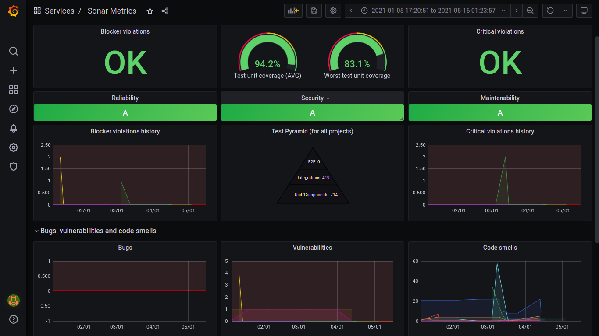
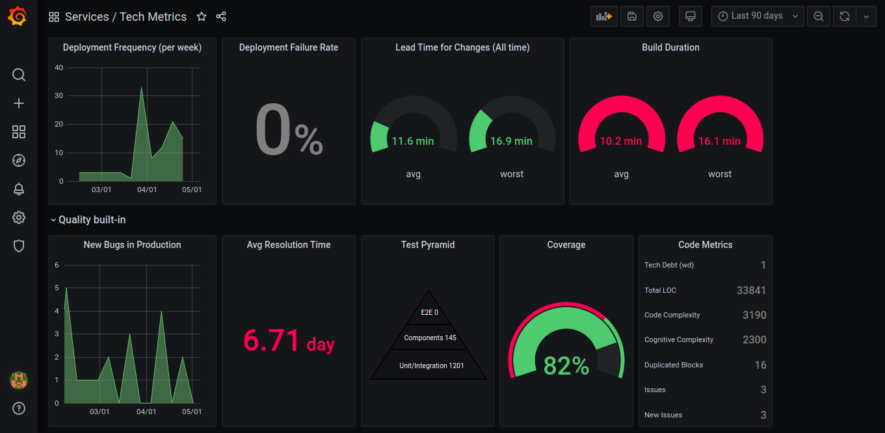
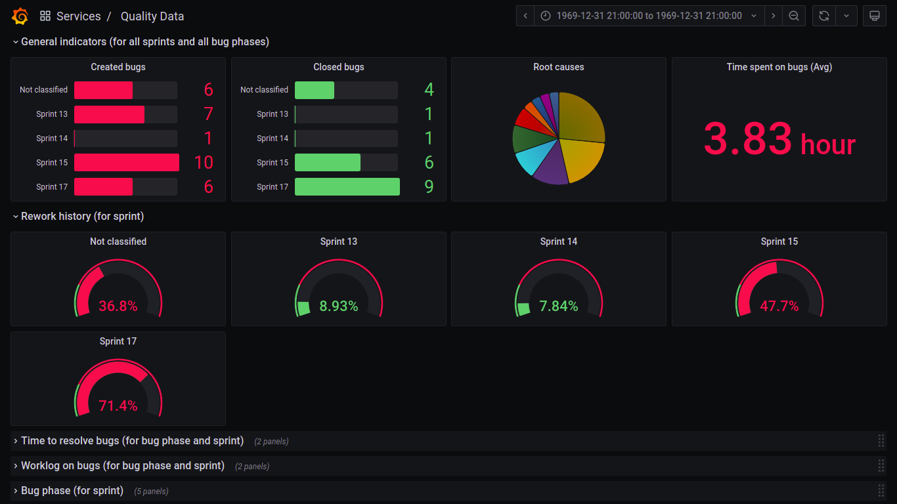
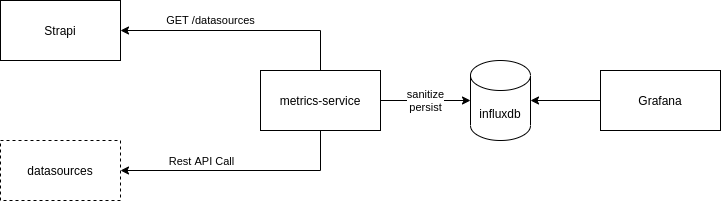

# Get Ultimate Reports Updated (G.U.R.U) Dashboard for Teams

 



## Overview
Stack responsible for providing technical and operational metrics to be visualized in grafana.



#### Componentes:
- Grafana: Responsible for dashboards, the ./grafana folder has all the configuration of datasources and dashboards to upload via docker.
- Influxdb: Timeseries database for metrics, is rising via docker with no mapped volume, so when the container dies the records are reset.
- Strapi: CMS for configurations, today we have two collections, datasources and custom-metrics.
- metrics-service: Service in nodeJS, responsible for reading the configurations of the strapi, and accessing the different datasources to obtain metrics, process them and insert in influxdb, in a recurring way according to the CRON configuration in the docker-compose.

## Requirements
- Docker
- Docker Compose
- Node 12+: just for development.

## Instructions

1 - Run
```
docker-compose up
```

2 - Then it is necessary to configure datasources for application via strapi, through: http://localhost:1337

Strapi datasorce is mandatory. The metrics-service application will be up, after you configure of the 1st time strapi datasource inside Strapi.

Default access:
user: admin@techmetrics.ciandt
pass: techmetrics

3 - That done, just access the grafana at http://localhost:3000 with username and password "admin".

## Datasources
Datasources are implementations of external providers, who must make the data available through Rest APIs, currently the following providers are available:

#### Jira

[JIRA DOCS](docs/jira.md)

#### Azure

[AZURE DOCS](docs/azure.md)

#### Sonar

[SONAR DOCS](docs/sonar.md)

#### Strapi (MANDATORY)

[STRAPI DOCS](docs/strapi.md)

### New Custom Providers
New providers can be implemented, for jenkins, GOCD, among other possibilities, for that it is necessary:

Create a new provider in:
```
./metrics-service/src/providers/provider_name
```
Follow sonar.provider as an example.

Then it is necessary to add it to the Record of provider.factory:
```
const providers: Record<string, ProviderFunction> = {
  azure: getAzureMetrics,
  sonar: getSonarMetrics,
  strapi: getStrapiMetrics,
  new_provider: getNewProviderMetrics(),
};
```

That done, it is enough that a new datasource is registered pointing to this provider within the strapi.

-----------------

###                                                                         Troubleshooting

### Clear influx tables

Ex: When you have changes in the strep meta, it is necessary to clean jira_bug and jira_hour in the BD

1 - pause metrics service container
    docker stop ID_CONTAINER

2 - access influx container
    docker exec -it ID_CONTAINER bash
    influx
    use devops
    DROP MEASUREMENT jira_bug
    DROP MEASUREMENT jira_hour
    exit

3 - Up container metrics service
    docker start ID_CONTAINER

### Debug metric service

After up the containers, if the information is not showing in the dashboard, look at the metrics-service log to analyze

docker-compose logs -f --tails=1000 metrics-service

### Access KEY (JIRA)

https: use protected key via URL: https://id.atlassian.com/
http: basic auth works normally
